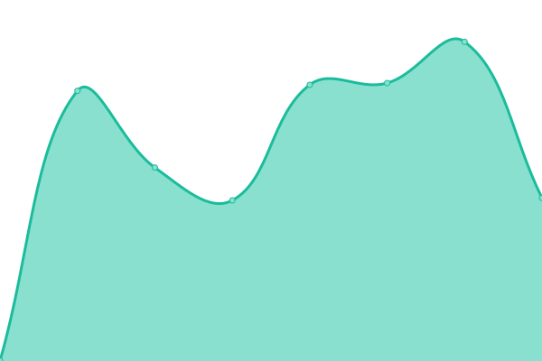
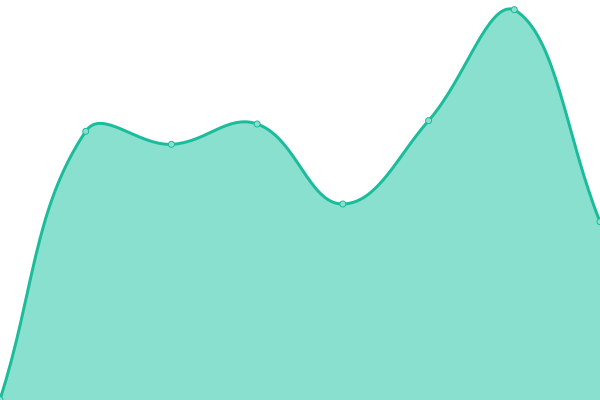

# [📈 Live Status](https://PSV-Bogenschiessen.github.io/uptime-monitor): <!--live status--> **🟩 All systems operational**

This repository contains the open-source uptime monitor and status page for [PSV-Bogenschiessen](https://PSV-Bogenschiessen.github.io/uptime-monitor), powered by [Upptime](https://github.com/upptime/upptime).

With [Upptime](https://upptime.js.org), you can get your own unlimited and free uptime monitor and status page, powered entirely by a GitHub repository. We use [Issues](https://github.com/PSV-Bogenschiessen/uptime-monitor/issues) as incident reports, [Actions](https://github.com/PSV-Bogenschiessen/uptime-monitor/actions) as uptime monitors, and [Pages](https://PSV-Bogenschiessen.github.io/uptime-monitor) for the status page.

<!--start: status pages-->
<!-- This summary is generated by Upptime (https://github.com/upptime/upptime) -->
<!-- Do not edit this manually, your changes will be overwritten -->
<!-- prettier-ignore -->
| URL | Status | History | Response Time | Uptime |
| --- | ------ | ------- | ------------- | ------ |
|  [Website](https://bogen-psv.de) | 🟩 Up | [website.yml](https://github.com/PSV-Bogenschiessen/uptime-monitor/commits/HEAD/history/website.yml) | 

 1462ms
     
 | 

<a href="https://PSV-Bogenschiessen.github.io/uptime-monitor/history/website">99.80%</a>
    

|  [Nextcloud](https://cloud.bogen-psv.de) | 🟩 Up | [nextcloud.yml](https://github.com/PSV-Bogenschiessen/uptime-monitor/commits/HEAD/history/nextcloud.yml) | 

 1512ms
     
 | 

<a href="https://PSV-Bogenschiessen.github.io/uptime-monitor/history/nextcloud">100.00%</a>
    

|  [Helfertool](https://helfer.bogen-psv.de) | 🟩 Up | [helfertool.yml](https://github.com/PSV-Bogenschiessen/uptime-monitor/commits/HEAD/history/helfertool.yml) | 

 973ms
     
 | 

<a href="https://PSV-Bogenschiessen.github.io/uptime-monitor/history/helfertool">100.00%</a>
    

|  [Einsteiger-Helfertool](https://einsteiger.anmeldung.bogen-psv.de) | 🟩 Up | [einsteiger-helfertool.yml](https://github.com/PSV-Bogenschiessen/uptime-monitor/commits/HEAD/history/einsteiger-helfertool.yml) | 

 1298ms
     
 | 

<a href="https://PSV-Bogenschiessen.github.io/uptime-monitor/history/einsteiger-helfertool">100.00%</a>
    

<!--end: status pages-->

[**Visit our status website →**](https://PSV-Bogenschiessen.github.io/uptime-monitor)

## 📄 License

- Powered by: [Upptime](https://github.com/upptime/upptime)
- Code: [MIT](./LICENSE) © [Anand Chowdhary](https://anandchowdhary.com), supported by [Pabio](https://pabio.com)
- Data in the `./history` directory: [Open Database License](https://opendatacommons.org/licenses/odbl/1-0/)
